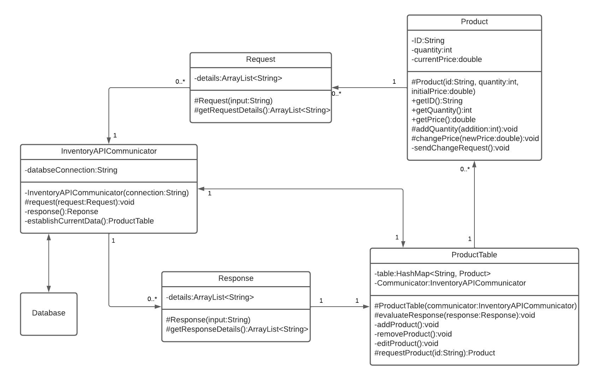

# PROJECT Design Documentation

## Team Component: Inventory_Accounting

## Team Information
* Team name: Inventory_Accounting
* Team members:
  * John D
  * Sakai A
  * Zach T

# Table of Contents
1. [Requirements](#Requirements)
2. [Technology Perspective](#Technology_Perspective)
3. [Technical Perspective](#Technical_Perspective)
4. [Application Domain](#Application_Domain)
5. [Architecture and Design](#Architecture_and_Design)
6. [APPENDIX](#APPENDIX)

## Executive Summary
Of the enterprise KennUWare we are in charge of Inventory and Accounting.

### Purpose
Inventory management must be able to store, procure and send materials. Accounting
must be able to manage the budget of each department to ensure enterprise wide functionality

### Glossary and Acronyms
> _Maintain a table of terms and acronyms._

| Term | Definition |
|------|------------|
| VO   | Value Object |

## Requirements  

*CRUD items
*List items (Total storage)
*Check Budget
*As an Inventory Manager I need to be able to receive and complete a request for components, so that products can be made
*As an Inventory Manager I need to be able to procure and store more materials, so that I can complete component requests
*As a member of Accounting I need to be able to set the budget of a department, so they can pay employees

### Definition of MVP
An internal product that is functional and easy to understand implementation of 
inventory management and accounting departments

### MVP Features
*As a Inventory Manager I need to be able to receive and complete a request for components, so that products can be made
*As an Inventory Manager I need to be able to procure and store more materials, so that I can complete component requests
*As a member of Accounting I need to be able to set the budget of a department, so they can pay employees

### Roadmap for User Stories
https://trello.com/b/IDxQEAjf/inventoryaccounting 

**Release 1:**
Across department integration stubbed out, design and technology have been decided on and base layer API implementation
1. As an employee I want to be able to store a component so I know where it is
2. As an employee I want to apply for more components
3. As an employee I want to be able to get a component from the warehouse to give to manufacturing

**Release 2:**
> _Brief intro main purpose of release_
1. As a ______ I want to ______ so that I can a______.
2.   ...
3.   
**Release 3:**
Internal team working APIs and website working, design and technology have been decided on and base layer API implementation with the potential to set up outward facing APIs
1. As an employee I want to be able to store a component so I know where it is
2. As an employee I want to apply for more components
3. As an employee I want to be able to get a component from the warehouse to give to manufacturing
 
## Technology Perspective  
We wanted to go with something simple and that we all understood, so we decided to go with a python mySQL stack.
 This allows us to easily create an API on top of our database connection for further use. We have also decided 
 to use java for the domain layer implementation. At this point we’re not borrowing any specific design details
 from an existing ERP solution. One of the primary risks is having too tight and inflexible a design at this 
 point, as we move forward, our design will likely have to accommodate all kinds of changes.

## Technical Perspective  
We endeavor to create a generic API on top of our database that we can modify and use to our benefit. 
 Knowing that the other team’s designs will impact our design, we chose to make our design easily modifiable.
 We will provide an API for other teams to easily interact with, so they can retrieve data from our component
 without issue.

## Application Domain  

The entity relationships for the inventory department shows the relationship between employees, managers and the 
department. As well as its weak dependance on other departments because while inventory is can stand alone 
in the future and realistically it has other dependancies on other departments so we included it with a focus on 
accounting specifically.

Showcases the technological calls and logic behind inventory management

## Architecture and Design  
>
Template and Single Page View
Templates give us the structure we need will allow us to quickly and more efficiently arrange our ideas 
and present them appropriately. Because of the foreseeable simplicity of our gui, a single page view 
will be our best option to minimize information requests and page creations. Overall we’ve chosen the options
that will require less customization to accommodate our low requirement for presentation.

Domain Model
Because we’re generally assuming that we’ll be dealing with varying products with their respective details
 such as quantity, ID’s and pricings, it would be best if all this information was contant is a stable container 
 for easy and efficient management and querying.
 
API Inventory Object Communicator to interact between the actual database and the domain objects. 
This is mostly a Table Module Pattern, having the Product objects referenced/contained by the ProductTable 
object, albeit the Products themselves send editing requests to the communicator.

### Summary

The actual user interface has not yet been implemented. What our system can do is create the API to create and sustain
the necessary data needed  in our database. The foundation is also laid so that in the future we can easily implement
our domain and guis (if we get there).

### Domain Layer

Domain Model
Because we’re generally assuming that we’ll be dealing with varying products with their respective details such as 
 quantity, ID’s and pricings, it would be best if all this information was contant is a stable container for easy and 
 efficient management and querying. API Inventory Object Communicator to interact between the actual database and the
 domain objects. This is mostly a Table Module Pattern, having the Product objects referenced/contained by the 
 ProductTable object, albeit the Products themselves send editing requests to the communicator.

States
Upon initialization of API connectivity and initial establishment of current database data into the actual table model,
 the application ideally remains idle until an editing request is activated. The request would then be processed by the
  communicator to the database and back with the response details for what has occurred by request. Assuming the 
  request went through effectively, changes would be done to the database and those response details would edit the
  table model to reflect those changes. The application would then re-enter idle mode until the next request.
  

  Communication Aspect of Inventory
  This diagram is more of a representation of the communications between the Inventory and the other components
   of the enterprise requesting sales and products. This means that we’ll need to keep track of what types of 
   products (whether actual products or components) will be stored and handled in our warehouses. This ties into 
   employees and how they need to receive pay from their managers for their management and general work. The requested 
   products will be sent to their requesters in the process at their appropriate pricings.
  
  
  Accounting aspects
  
  

### Data Source Layer
The actual communication between the database and domain will be established through Python and mySQL queries and 
responses. Assuming requests passed by the domain layer get processed effectively here, the results of queries of both
 edits and basic searches will be sent back to the domain layer.

### Presentation Layer
We will be using Single Page View designs and implementing it with swagger, postgresSQL, react and python
in order to create a usable user interface.
> 
### Design Rationale and Improvements
One point of concern for change may be that the table module that we’re planning to use for implementation may not 
 be either appropriate or sufficient for what other parties may need to use. In this case, it wouldn’t be too much of
 a struggle to refactor the implementation into a more domain model pattern in order to more effectively use the OO
 patterns involved, allowing for a more flexible application environment. This works better anyway since some of
 the domain logic is involved by the Product objects themselves. The most preventive method of ensuring that our 
 application cooperates with other parties is ensuring that the functionality remains flexible and loosely coupled 
 so we can rearrange application logic and functions more efficiently if need be. Basic communication with the other 
 parties and their applications’ implementations and requirements are also essential to ensure that neither group 
 advances too far to the point that component communication and integration becomes too difficult or complex.
 We have come to these decisions because we have recognized that with the lowered scope of the project it would
 be best for us to go with technology we are familiar with and 'easy' to use. Also because other groups have experience
 with them for the most part future integration should not be a challenge.

### APPENDIX   

https://trello.com/b/IDxQEAjf/inventoryaccounting

### (OPTIONAL sections possibly covered in other documents)
## Testing
> _This section will provide information about the testing performed
> and the results of the testing._

### Acceptance Testing
> _Report on the number of user stories that have passed all their
> acceptance criteria tests, the number that have some acceptance
> criteria tests failing, and the number of user stories that
> have not had any testing yet. Highlight the issues found during
> acceptance testing and if there are any concerns._

### Unit Testing, System Testing and Code Coverage
> _Discuss your unit testing strategy. Report on the code coverage
> achieved from unit testing of the code base. Discuss the team's
> coverage targets, why you selected those values, and how well your
> code coverage met your targets. If there are any anomalies, discuss
> those._
